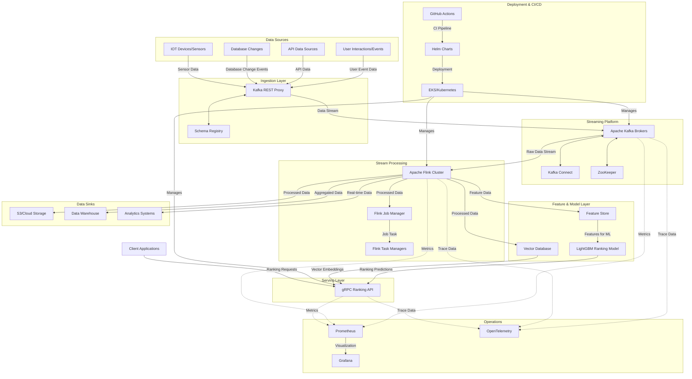

# Architecture

EagleRank is designed for scalable, real-time ranking using a modern, event-driven architecture inspired by leading tech companies ([source](https://craft.faire.com/building-faires-new-marketplace-ranking-infrastructure-a53bf938aba0)).

## Main Components
- **Event Ingestion**: Apache Kafka for high-throughput, durable event streaming.
- **Stream Processing**: Apache Flink for real-time feature computation and event handling.
- **Feature Store**: Centralized, low-latency feature management for ML models.
- **Ranking Service**: Hosts and serves ML models for real-time ranking.
- **APIs**: gRPC and gRPC-Web endpoints for integration.
- **Monitoring**: Prometheus, Grafana, and OpenTelemetry for observability.

## Real-Time Stream Processing (Apache Flink)
See [Feature Store](feature-store.md) and [Performance & Scaling](performance.md) for details on Flink jobs, state management, and real-time feature computation.

## Social Graph Service
See [Feature Store](feature-store.md) for details on social graph storage and retrieval.

## Candidate Generation Service
See [Ranking Models](ranking-models.md) and [Feature Store](feature-store.md) for candidate generation logic and integration with the social graph and feature store.

## Ranking Service (Machine Learning Scoring)
See [Ranking Models](ranking-models.md) for a detailed description of the ranking pipeline, model architecture, and multi-tenancy strategies.

## API Gateway (gRPC & REST)
See [API Reference](api.md) for API contracts, gateway orchestration, and integration patterns.

## Web UI Design and Implementation
See [API Reference](api.md) and [Monitoring & Observability](monitoring.md) for details on the Web UI, gRPC-Web integration, and observability features.

## API and Data Contracts
See [API Reference](api.md) for gRPC API definitions, Kafka message schemas, and feature data formats.

## Data Flow
1. **Events** (user actions, item updates) are published to Kafka.
2. **Flink** jobs consume events, compute features, and update the Feature Store.
3. **Ranking Service** fetches features and scores items using ML models.
4. **APIs** return ranked results to clients in real time.
5. **Monitoring** tools collect metrics and traces for all components.

## Diagram

---

### Explanation of Labeled Data Flows

**Data Sources:**
- **User Event Data:** Captures user interaction events (clicks, activity, etc.) and sends it to the Kafka REST Proxy.
- **API Data:** API calls or data from external services that need to be ingested into the system.
- **Database Change Events:** Any changes to databases (e.g., new entries, updates) are captured and sent to Kafka.
- **Sensor Data:** IoT devices and sensors sending real-time data (e.g., temperature, humidity) into the Kafka system.

**Ingestion Layer:**
- **Kafka REST Proxy** collects all the data from the sources and pushes it into Apache Kafka Brokers. The data is validated through Schema Registry.

**Streaming Platform:**
- **Raw Data Stream:** Data from Kafka is ingested into Apache Flink for processing.
- **Processed Data:** After processing, Flink sends the transformed data to various downstream components.

**Stream Processing:**
- **Feature Data:** Processed data (like features) is sent from Flink to the Feature Store for storage and feature management.
- **Processed Data:** Transformed data that will be used for further ranking or search is pushed to the Vector Database.

**Feature & Model Layer:**
- **Features for ML:** The Feature Store supplies the necessary features to the LightGBM Ranking Model for ranking or recommendation purposes.
- **Ranking Predictions:** The ranking predictions are then served via the gRPC Ranking API for real-time consumption.
- **Ranking Predictions:** Vector Database contributes its ranking predictions to the Ranking API.

**Serving Layer:**
- **Ranking Predictions:** Both the model predictions and vector search results are served via the Ranking API to client applications.

**Data Sinks:**
- **Processed Data:** Flink processes data and stores it in S3/Cloud Storage.
- **Aggregated Data:** Flink aggregates data and writes it into the Data Warehouse for analytics and reporting.
- **Real-time Data:** Flink sends real-time processed data to the Analytics Systems for immediate insights.

**Operations:**
- **Monitoring:** Prometheus collects metrics from Kafka Brokers, Flink Cluster, and Ranking API.
- **Visualization:** Grafana visualizes the metrics collected by Prometheus.
- **Tracing:** OpenTelemetry or Jaeger collects and traces the flow of data between the components.

**Deployment & CI/CD:**
- **GitHub Actions** automates the deployment process using Helm to deploy on EKS/Kubernetes. Flink Cluster, Kafka Brokers, and Ranking API are deployed and managed via this process.

**Client Interaction:**
- **Client Applications** send user requests to the Ranking API to receive personalized rankings or recommendations.

---

For details on each component, see [Feature Store](feature-store.md), [Ranking Models](ranking-models.md), and [API Reference](api.md). 